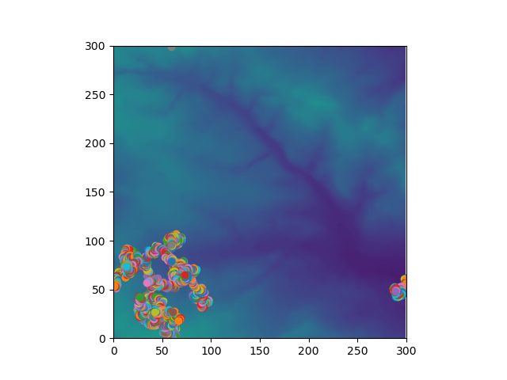
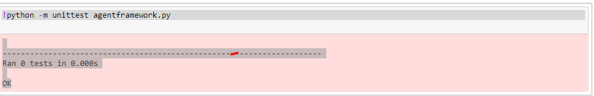

## Introduction

This repository is a simple agent-based model (ABM). It is a model that involves agents wandering around and eating material (data) from the underlying landscape. The model builds up a series of agents in space where each agent has a list of other agents that it communicates with and where each agent knows about the environment it is in and is able to change or query the environment. The agents moves around to check whether other agents are not in the neighbourhood and when it confirms that, it moves around the environment to eat it. The environment contains data from a file which is displayed along with the environment after the model is run. Lastly, the environment saves as the result of the mdoel. 

## List of Files
model.py: This is the code that deals with interacting with the user and setting up of the model, including running the model iterations and checking the stopping conditions. 
agentframework: It is used to build agents that can include the agent's behaviour and any records of their state. The behaviours implemented here is mathematical, or statistical.
in.txt:
out.txt:
Figure_1.png:
b1.png:
License:

## Core Components of the ABM
The model consists of the following core components:
1. The Environment
2. The Animals/Agents

### The Environment
The environment is a Euclidean 2D plane that is generated from reading the data in the CSV file [in.txt]. Upon running the model, the model writes the environment data into  a CSV file [out.txt]. Everytime a user runs the model, this file is overwritten accordingly.

## The Animals/Agents
The Animals are basically agents that move around the environment, evaluate the distance between themselves, and not going beyond the limits of the environment.The Animal agents were built in a separate class using an object-oriented approach. This is defined in the Agent [agentframework.py] class. The intial x and y coordinates of the animsls are set in the class and their values are retrieved from the a collection of web data that was scraped. The animal class additionally sets the initial store values of the animal agents randomly. The store represents the level of the animal's energy when the animal eats.

## How to run the model

##Model

write_line_to_output(s): The function writes output and reads input from text file

get_maximum(): The function checks environment for largest value

get_minimum(): The function checks environment for minimum value

run(), update() and gentfunction() are developed  for GUI of the system

## Unittest

